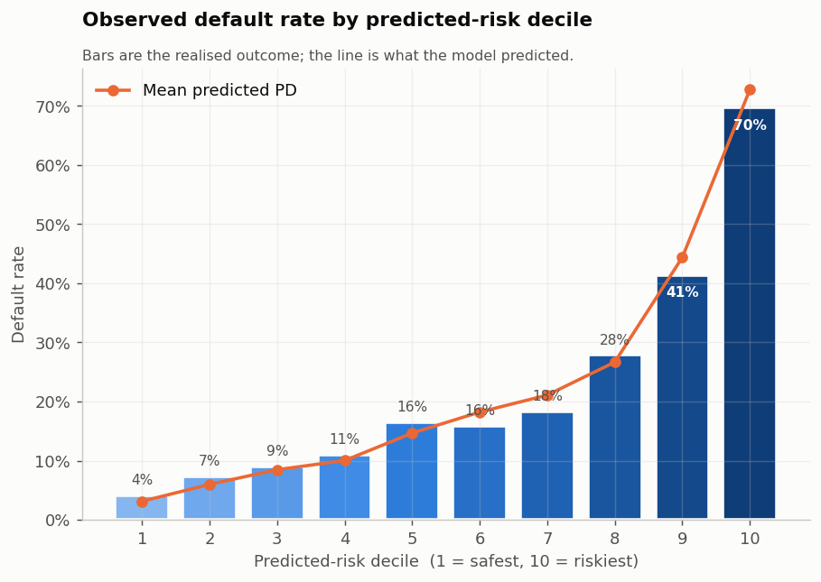
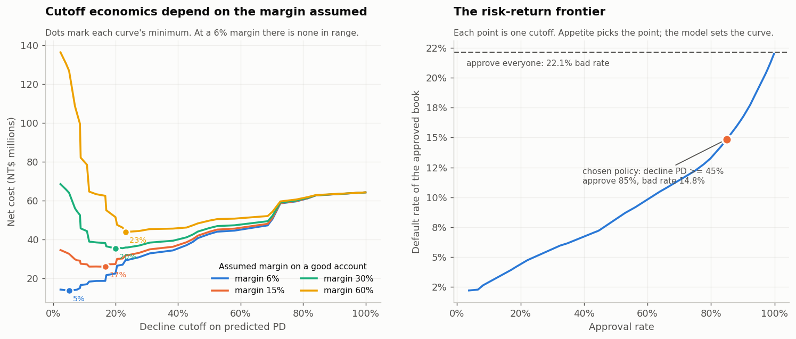
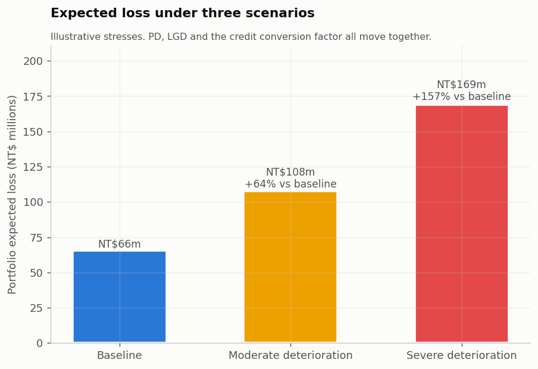
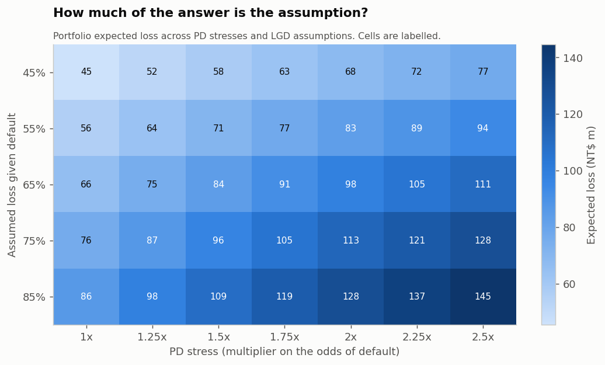
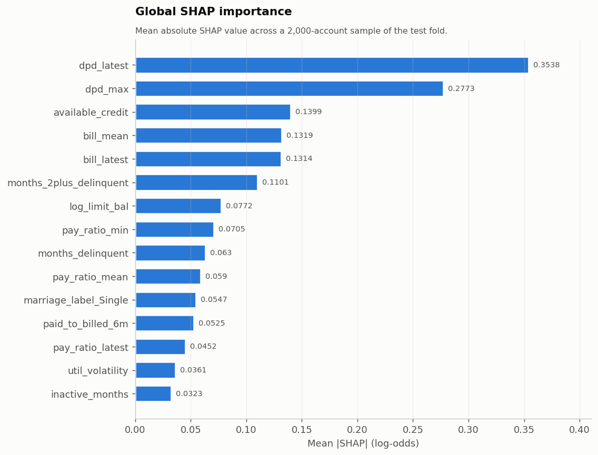
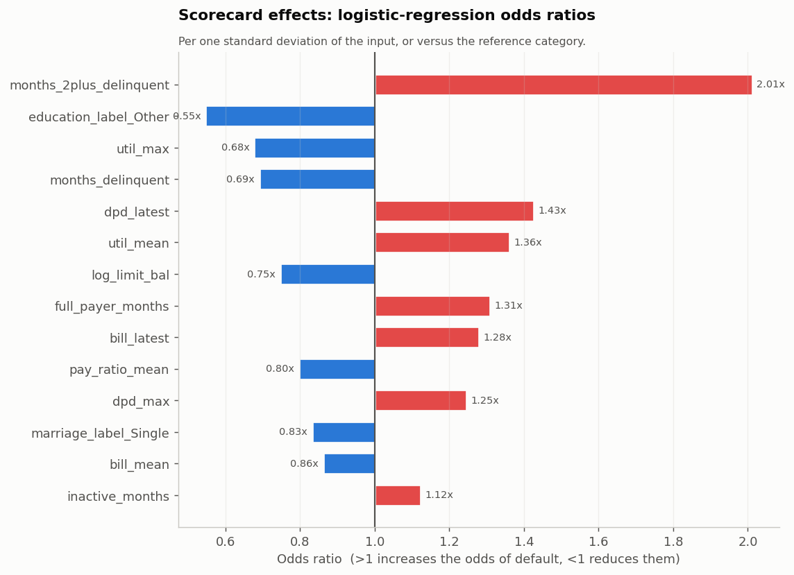

# Consumer Loan Credit Risk Modeling and Expected Loss Analysis

Probability-of-default modelling, expected-credit-loss estimation and scenario analysis on
the UCI *Default of Credit Card Clients* dataset (Taiwan, 2005; 30,000 accounts).

## What this project does, in plain terms

A credit-card lender needs to answer three questions about the customers already on its
books, and this project answers all three from the data alone.

**Who is likely to miss their next payment?** Each account gets a score between 0% and 100%
- its chance of failing to pay next month. The model learns this from six months of billing
and repayment history: how much was owed, how much was actually paid, and how many months
each customer had fallen behind.

**How much money is at risk?** A chance of default is not yet a loss. To turn one into the
other you need three things: how likely the customer is to default, how much they will owe
at that moment, and how much of that the lender fails to recover. Multiply them together and
you get the **expected loss** - the amount the lender should expect to write off. This
project computes it for every account and adds them up.

**What happens if conditions get worse?** Unemployment rises, people fall behind, and
recoveries shrink. The project re-runs the loss calculation under a mild downturn and a
severe one, so the lender can see the size of the hole before it appears.

The honest caveat, stated everywhere in this repository: only the first of those three
ingredients can be measured from this dataset. How much a lender recovers after a default is
not recorded anywhere in it, so that number is an **assumption**, clearly labelled as one.
Every currency figure here rises and falls with it.

**How to read the results.** Two ideas do most of the work. A model can be good at *ranking*
- putting the risky customers above the safe ones - and separately good at *calibration* -
being right about the actual level of risk. Ranking is what you need to decide who to
decline. Calibration is what you need to put a number on the losses, because a model that
ranks perfectly but is systematically too low produces a loss estimate that is too low by
the same amount. Both are measured here, on data the model never saw.

## The business question

Stated formally: **can borrower and account characteristics be used to estimate the
probability of default, rank accounts by risk, and translate that into an expected credit
loss under baseline and stressed conditions?**

Every figure below is computed on a held-out test fold of 5,993 accounts that
no model saw during training, model selection, calibration or cutoff setting. Re-running
`python -m src.run_pipeline` regenerates all of them, and re-running
`python -m src.build_reports` regenerates this file - none of the numbers in this README are
typed by hand.

Every abbreviation used below is defined in the [glossary](#glossary) at the end.

---

## Headline results

| | |
| --- | --- |
| Champion model | **Gradient boosting (XGBoost)** |
| Test ROC-AUC / Gini / KS | **0.778** / 0.556 / 0.427 |
| Test PR-AUC (base rate 22.1%) | **0.552** |
| Brier score / expected calibration error | 0.1351 / 0.0174 |
| Logistic-regression benchmark (ROC-AUC) | 0.764 - the champion beats it by 0.0136 |
| Riskiest decile default rate | **70%** vs 4.2% in the safest decile (3.1x lift) |
| Defaults captured in the riskiest two deciles | 50% |
| Portfolio exposure at default (test fold) | NT$549.0m |
| Baseline expected loss | NT$65.7m (11.96% of exposure) |
| Severe-scenario expected loss | NT$168.9m (+157%) |

**What those measures mean.** *ROC-AUC* is how reliably the model puts a customer who
defaults above one who does not, when you draw one of each at random: 0.5 is a coin flip and
1.0 is perfect, so 0.778 means it gets that comparison right about
78% of the time. *Gini* is the same information on a 0-to-1 scale
(0.556). *KS* is the widest gap between the score distributions of
defaulters and non-defaulters. *PR-AUC* measures performance on the minority group - only
22.1% of accounts default - where a naive model scores
0.221. *Brier score* and *calibration error* check whether the
predicted percentages are true in level, not just in order; both are better when smaller.

**What is estimated and what is assumed.** PD is estimated from the data. Loss given default
is *not*: the dataset contains no recovery, collection or charge-off information, so LGD is a
stated assumption (65% baseline) and every loss figure moves one-for-one with
it. Exposure at default combines the observed balance with an assumed 35%
credit conversion factor on the undrawn line. This split is stated everywhere the numbers
appear, and `outputs/tables/sensitivity_grid.csv` shows the whole PD-stress x LGD surface
rather than a single loss number.

---

## Deliverables

| Deliverable | Where |
| --- | --- |
| Technical notebook | [`notebooks/01_credit_risk_modelling.ipynb`](notebooks/01_credit_risk_modelling.ipynb) |
| Executive summary | [`docs/executive_summary.md`](docs/executive_summary.md) |
| Two-page risk memo | [`docs/risk_memo.md`](docs/risk_memo.md) |
| Model card | [`docs/model_card.md`](docs/model_card.md) |
| Data dictionary | [`docs/data_dictionary.md`](docs/data_dictionary.md) |
| Interactive risk dashboard | **[Open the live app](https://credit-risk-el-modeling.streamlit.app)** - move the loss-given-default, credit-conversion-factor, stress and cutoff sliders and every figure recomputes. Source: [`dashboard/app.py`](dashboard/app.py) |
| Static risk dashboard | **[View it live](https://pooja003-cloud.github.io/credit-risk-el-modeling/dashboard/dashboard.html)** or open [`dashboard/dashboard.html`](dashboard/dashboard.html) locally |
| Model-comparison table | [`outputs/tables/model_comparison.csv`](outputs/tables/model_comparison.csv) |
| Expected-loss tables | [`outputs/tables/`](outputs/tables/) (`el_by_risk_decile.csv`, `el_by_*.csv`, `scenario_summary.csv`) |
| Figures | [`outputs/figures/`](outputs/figures/) |

---

## Quickstart

```bash
git clone https://github.com/pooja003-cloud/credit-risk-el-modeling.git
cd credit-risk-el-modeling
python -m venv .venv && source .venv/bin/activate    # Windows: .venv\Scripts\activate
pip install -r requirements.txt

python -m src.run_pipeline            # data -> models -> evaluation -> EL -> figures
python -m src.build_static_dashboard  # rebuild dashboard/dashboard.html
python -m src.build_reports           # rebuild README and the written deliverables
streamlit run dashboard/app.py        # interactive dashboard

pytest -q                             # regression tests on the risk maths
python tools/verify_results.py        # recompute every headline number independently
```

The raw dataset is committed in `data/raw/`, so the pipeline runs offline. Full run:
about a minute on a laptop.

---

## Data and preparation

**Source.** UCI Machine Learning Repository, *Default of Credit Card Clients* (Yeh & Lien,
2009) - 30,000 Taiwanese credit-card accounts observed April-September 2005, with a binary
flag for default in October 2005. Amounts are in New Taiwan dollars.

The loader validates the file against the published dataset statistics before anything else
runs - 30,000 rows, 6,636
defaults, a 22.12% default rate - and raises if a
mirror does not match, so a truncated or altered copy cannot flow silently into the models.

Preparation decisions, all reproducible in `src/data_prep.py`:

- **35 exact duplicate rows** (identical on every
  field except `ID`) dropped, so the same account cannot appear in both training and test.
- **468 `EDUCATION` values** and
  **377 `MARRIAGE` values** carry
  undocumented codes; each is collapsed into an explicit "Other" level rather than treated
  as a distinct category.
- **3,932 negative bill amounts** are retained -
  they are credit balances (overpayments), not errors - and utilisation features floor them
  at zero.
- `PAY_0` renamed `PAY_1` so repayment status lines up with the bill and payment columns.
- Raw `PAY_*` codes (-2 = no usage, -1 = paid in full, 0 = revolving) are **not** used as a
  numeric severity scale. They are split into non-negative months-past-due plus explicit
  counts of revolving, full-payment and inactive months.
- **28 engineered features**: utilisation level, trend and
  volatility; payment ratios; delinquency depth, breadth and direction; balance dynamics;
  available credit; demographics.
- Stratified **60 / 20 / 20** train / validation / test split. The dataset has no origination
  or observation dates - every account shares the same six-month window - so a time-based
  split is not possible. That limitation is recorded in the model card rather than papered
  over.

### Data leakage: the boundary this project draws

The target is default in **October 2005**; every feature is dated **September 2005 or
earlier**, so no post-outcome information is used. That is the easy half.

The harder half is being clear about *which decision* the model supports. A model with six
months of repayment history is a **behavioural** scorecard - the tool for re-underwriting,
limit management and collections prioritisation on an existing account. It is not an
**application** scorecard, because at origination none of that history exists. Quoting the
behavioural AUC as if it applied at account opening would be leakage relative to the decision
being made, so both models are built and reported:

| Feature set | Model | Features | roc auc | gini | pr auc | ks | brier |
| --- | --- | --- | --- | --- | --- | --- | --- |
| Behavioural (6 months of history) | Logistic regression | 28 | 0.7643 | 0.5286 | 0.5168 | 0.4089 | 0.1381 |
| Behavioural (6 months of history) | Gradient boosting (XGBoost) | 28 | 0.7779 | 0.5557 | 0.5516 | 0.4271 | 0.1351 |
| Origination only (limit + demographics) | Logistic regression | 5 | 0.6217 | 0.2434 | 0.2969 | 0.1841 | 0.1671 |
| Origination only (limit + demographics) | Gradient boosting (XGBoost) | 5 | 0.6267 | 0.2533 | 0.3153 | 0.2003 | 0.1664 |

Roughly 0.15
of ROC-AUC comes from the repayment history alone. The origination-only model is barely
better than a coin flip once history is removed, which is the honest measure of how much of
this model's power an application-time user would *not* get.

---

## Models and results

Five model families, each selected on the validation fold with a small explicit grid, then
scored once on test.

**Calibration is treated as a modelling step, not an afterthought,** because expected loss
multiplies PD *levels* and an uncalibrated ranking score cannot be used in
`EL = PD x LGD x EAD`. Isotonic and Platt scaling are compared by five-fold cross-validation
*inside* the validation fold - judging a calibrator on the same rows it was fitted on would
flatter the more flexible method - and the winner is refitted on the whole fold with the base
model frozen, so calibration never touches training data or the test fold. The champion's
chosen method was **isotonic**.

Calibrated probabilities are then floored at 0.03% and capped at 99.97%.
Isotonic calibration is a step function and will assign a PD of exactly 0 or exactly 1 to
accounts in its outermost steps; a PD of zero would zero out that account's expected loss
entirely. Supervisory frameworks handle this with an explicit floor - Basel uses 0.03% for
retail exposures - and the same device is used here.

| Model | Validation ROC-AUC | Test ROC-AUC | PR-AUC | KS | Brier | Calibration error |
| --- | --- | --- | --- | --- | --- | --- |
| Baseline (prior) | 0.5000 | 0.5000 | 0.2213 | 0.0000 | 0.1723 | 0.0000 |
| Logistic regression | 0.7812 | 0.7643 | 0.5168 | 0.4089 | 0.1381 | 0.0117 |
| Decision tree | 0.7808 | 0.7671 | 0.5147 | 0.4080 | 0.1375 | 0.0161 |
| Random forest | 0.7937 | 0.7752 | 0.5349 | 0.4120 | 0.1354 | 0.0171 |
| Gradient boosting (LightGBM) | 0.7918 | 0.7780 | 0.5664 | 0.4296 | 0.1351 | 0.0136 |
| Gradient boosting (XGBoost) | 0.7958 | 0.7779 | 0.5516 | 0.4271 | 0.1351 | 0.0174 |

Accuracy is deliberately not a headline: approving every account scores
78% accurate on this portfolio and identifies no defaults at all.

**The gradient-boosting gain over the scorecard is real but small** -
+0.0136 ROC-AUC, +0.0348
PR-AUC. That is worth saying plainly: on this dataset a fully interpretable logistic
regression gets most of the way, and the complexity of a boosted model has to be justified by
more than a third decimal place.

**Stability.** ROC-AUC is 0.811 on train, 0.796 on validation and
0.778 on test - mild optimism, no collapse. The population stability index
between the training and test score distributions is
0.0007, far below the 0.10 monitoring trigger, as expected
for a random split of one cohort.

### Rank-ordering

| Decile | accounts | defaults | Observed default rate | Mean predicted PD | Lift | Share of exposure | Cumulative defaults captured |
| --- | --- | --- | --- | --- | --- | --- | --- |
| 1 | 600 | 25 | 4.2% | 3.1% | 0.19x | 16.4% | 100% |
| 2 | 599 | 44 | 7.3% | 6.0% | 0.33x | 14.2% | 98% |
| 3 | 599 | 54 | 9.0% | 8.5% | 0.41x | 11.8% | 95% |
| 4 | 599 | 66 | 11.0% | 10.0% | 0.50x | 10.8% | 91% |
| 5 | 600 | 99 | 16.5% | 14.7% | 0.75x | 9.5% | 86% |
| 6 | 599 | 95 | 15.9% | 18.2% | 0.72x | 8.1% | 78% |
| 7 | 599 | 110 | 18.4% | 21.1% | 0.83x | 7.6% | 71% |
| 8 | 599 | 167 | 27.9% | 26.7% | 1.26x | 7.1% | 63% |
| 9 | 599 | 248 | 41.4% | 44.4% | 1.87x | 6.7% | 50% |
| 10 | 600 | 418 | 69.7% | 72.7% | 3.15x | 7.9% | 32% |



### The two errors and where the cutoff sits

A false negative - approving an account that defaults - costs `LGD x EAD`. A false positive -
declining an account that would have paid - costs the forgone margin on the balance that
customer would have carried. Under the assumptions here those are roughly an order of
magnitude apart, so a 0.5 cutoff is simply the wrong place to stand.

| Cutoff rule | PD cutoff | Share declined | Precision | Recall | F1 |
| --- | --- | --- | --- | --- | --- |
| risk_appetite_15%_bad_rate | 44.7% | 15.4% | 0.618 | 0.430 | 0.507 |
| f1_optimal | 27.5% | 25.4% | 0.501 | 0.575 | 0.535 |
| cost_minimising | 5.1% | 92.1% | 0.237 | 0.986 | 0.382 |
| naive_0.5 | 50.0% | 12.4% | 0.663 | 0.373 | 0.477 |

The **deployed cutoff of 44.7%** was chosen on the
validation fold as the loosest rule that holds the approved book's default rate at or below
the 15% risk-appetite target. Applied to the test fold it
declines 15% of accounts (922) and cuts the realised
default rate of the approved book from 22.1% to
**14.9%**. It catches 570 of the
1,326 defaults in the fold and turns away
352 accounts that would in fact have paid.

This is a retrospective evaluation on held-out data, not a claim that lending decisions
improved - no live decisions were made, and the accounts declined by the rule were extended
credit in reality.

The purely cost-minimising cutoff is reported alongside it and comes out at
5.1%, which would decline most of the portfolio. That is
not a credible policy; it is what happens when a one-period loss is weighed against one period
of margin. `outputs/tables/cutoff_margin_sensitivity.csv` shows the implied cutoff moving from
5% to
23% as the
assumed margin rises, which is exactly why the deployed cutoff is set by risk appetite instead.



---

## Expected loss

```
EL = PD x LGD x EAD
```

| Component | How it is obtained | Status |
| --- | --- | --- |
| **PD** | Calibrated champion model | Estimated from data |
| **EAD** | Drawn balance + CCF x undrawn line | Balance and line observed; **CCF 35% assumed** |
| **LGD** | Stated assumption | **Assumed 65%** - not estimable from this dataset |

A credit card is a revolving commitment, so exposure at the moment of default is not today's
balance: distressed borrowers typically draw further before they stop paying. Using the
balance alone understates exposure; using the full credit line overstates it. The credit
conversion factor is the assumed share of the undrawn line drawn between today and default.

On the test fold, exposure at default is NT$549.0m against
NT$307.7m of drawn balances and NT$1,007.5m of
committed limits.

**A partial check on the EL number.** Holding the LGD assumption fixed, the loss actually
implied by the accounts that defaulted is NT$67.5m, against
a modelled expected loss of NT$65.7m - a
2.7% gap. That tests
the PD and EAD components against outcomes; it says nothing about whether the LGD assumption
itself is right.

### Scenario analysis

| Scenario | pd odds multiplier | lgd assumed | ccf assumed | average pd | EAD (NT$) | Expected loss (NT$) | EL / EAD | vs baseline |
| --- | --- | --- | --- | --- | --- | --- | --- | --- |
| Baseline | 1.00x | 65% | 35% | 22.55% | 549,007,196 | 65,671,322 | 11.96% | +0% |
| Moderate deterioration | 1.50x | 75% | 45% | 28.33% | 619,550,704 | 107,515,246 | 17.35% | +64% |
| Severe deterioration | 2.25x | 85% | 55% | 34.95% | 690,094,213 | 168,871,865 | 24.47% | +157% |

Each scenario moves all three components together, because in a downturn they do not move
independently. The PD stress is applied to the **odds** of default, equivalent to a constant
shift on the log-odds (score) scale, so PDs stay inside (0, 1) and the stress is proportionate
across the risk spectrum instead of pushing high-risk accounts above 1.0.

Scenario severities are judgemental and are **not** calibrated to a published macroeconomic
model. They are labelled as illustrative wherever they appear.





---

## What drives the score

Three views, because a single importance ranking is not an explanation:

- **Logistic-regression odds ratios** - direction and size of each effect, auditable line by line.
- **Permutation importance** - measured on held-out data, so it reflects what the model relies
  on rather than what it split on.
- **SHAP** - additive per-account attributions, which also give reason codes for individual
  accounts (`outputs/tables/reason_codes_*.csv`).

All three agree on the ranking: recent arrears status dominates, followed by the depth and
persistence of delinquency, then available credit and balance level. The clean read is that
*how the customer has been paying* matters far more than *who the customer is*.





---

## Repository layout

```
credit-risk-el-modeling/
├── data/raw/                     UCI dataset, committed so the pipeline runs offline
├── src/
│   ├── config.py                 paths, seeds and every risk assumption in one place
│   ├── data_prep.py              validation, cleaning, features, leakage-aware feature sets
│   ├── models.py                 model ladder, validation-fold selection, calibration
│   ├── evaluate.py               discrimination, calibration, thresholds, deciles, segments
│   ├── expected_loss.py          EAD construction, EL, decision-rule evaluation
│   ├── scenarios.py              PD stressing on the odds scale, scenarios, sensitivity grid
│   ├── explainability.py         odds ratios, permutation importance, SHAP, PSI
│   ├── plots.py                  every figure
│   ├── run_pipeline.py           end-to-end run; writes outputs/tables/results.json
│   ├── build_static_dashboard.py self-contained HTML dashboard
│   └── build_reports.py          regenerates README and the written deliverables
├── notebooks/                    technical walkthrough
├── dashboard/                    Streamlit app + static HTML dashboard
├── docs/                         executive summary, risk memo, model card, data dictionary
├── outputs/{figures,tables,models}
└── tests/                        regression tests on the risk maths
```

---

## Limitations

- **One cohort, one outcome month.** No out-of-time validation is possible; the split is
  stratified-random, not time-based.
- **Taiwan, 2005.** The portfolio follows a domestic card-debt crisis. A
  22% default rate is not a through-the-cycle rate and none of these
  levels should be read across to another book.
- **Behavioural, not application.** The champion model needs six months of repayment history.
- **LGD is assumed, not estimated.** Every currency figure inherits that assumption.
- **No macroeconomic variables.** Unemployment and rates enter only through scenario
  multipliers, not as model inputs.
- **Demographic inputs.** Sex, education and marital status are present in the dataset and are
  used here for segment monitoring. Several are prohibited or restricted inputs for credit
  decisions in many jurisdictions; a deployable model would exclude them and be tested for
  disparate impact.

---

## Glossary

Terms are listed in the order they first matter, not alphabetically.

| Term | What it means |
| --- | --- |
| **Default** | The customer fails to make the required payment. Here, specifically, failing to pay in October 2005. |
| **PD** - probability of default | The chance that an account defaults, between 0% and 100%. This is what the model predicts. |
| **EAD** - exposure at default | How much the customer owes at the moment they default. Not the same as today's balance: a card is a revolving credit line, and people in trouble tend to draw down more before they stop paying. |
| **CCF** - credit conversion factor | The assumed share of the *unused* part of the credit limit that gets drawn between now and default. Used to turn today's balance into an exposure at default. Assumed here, at 35%. |
| **LGD** - loss given default | The share of the exposure the lender ultimately fails to recover, after collections and any settlement. Assumed here, at 65%, because this dataset records no recoveries. |
| **EL** - expected loss | `PD x LGD x EAD`. The amount a lender should expect to lose on an account, in money. |
| **Basis point (bp)** | One hundredth of a percentage point. A 3bp floor means 0.03%. |
| **ROC-AUC** | How reliably the model ranks a defaulter above a non-defaulter. 0.5 is random, 1.0 is perfect. The standard headline measure of a credit model's discrimination. |
| **Gini** | The same information as ROC-AUC on a 0-to-1 scale, calculated as `2 x ROC-AUC - 1`. Preferred in most credit-risk teams. |
| **KS** - Kolmogorov-Smirnov statistic | The widest separation between the score distributions of defaulters and non-defaulters. The traditional separation measure in retail scorecards. |
| **PR-AUC** - precision-recall area under the curve | Performance on the minority group. More informative than ROC-AUC when defaults are rare. |
| **Precision** | Of the accounts the model flags as risky, the share that really do default. |
| **Recall** | Of all the accounts that really default, the share the model flags. |
| **Calibration** | Whether a predicted 8% really corresponds to 8 defaults in every 100 such accounts. Different from ranking, and essential for loss estimates. |
| **Brier score** | The average squared error of the predicted probabilities. Smaller is better. |
| **Expected calibration error** | The average gap between predicted and observed default rates across risk bands. Smaller is better. |
| **Decile** | A tenth of the portfolio, sorted by predicted risk. Decile 1 is the safest 10%, decile 10 the riskiest. |
| **Lift** | How much more often a group defaults than the portfolio average. A lift of 3 means three times the average rate. |
| **Cutoff** | The predicted-PD level above which an account is declined. |
| **Behavioural scorecard** | A model that uses repayment history on an existing account. Used for limit changes, collections and loss reporting. This project's champion model is one. |
| **Application scorecard** | A model that scores a *new* applicant, before any repayment history exists. This project builds one only as a comparison. |
| **Data leakage** | Using information that would not have been available at the moment of the decision, which flatters results in testing and fails in reality. |
| **Delinquency / arrears** | Being behind on payments, measured here in whole months. |
| **Revolving** | Paying only the minimum and carrying the balance forward. |
| **Utilisation** | The share of the credit limit currently used. |
| **Stress scenario** | A deliberately worse set of assumptions - more defaults, lower recoveries - used to size losses in a downturn. |
| **Log-odds** | The scale credit scores live on. Stressing a model on this scale keeps every probability between 0% and 100% and moves risky and safe accounts proportionately. |
| **Isotonic / Platt scaling** | Two standard methods for correcting a model's predicted probabilities after training. |
| **PSI** - population stability index | A monitoring measure of how far a scored population has drifted from the one the model was built on. Below 0.10 is stable. |
| **SHAP** | A method that attributes a single prediction to its individual inputs, so a score can be explained account by account. |
| **Champion / challenger** | The model in use, and the simpler or rival model kept alongside it as a benchmark. |
| **Train / validation / test** | The three slices of data: one to fit the model, one to tune and calibrate it, and one untouched until the end, used to report honest performance. |

---

## Reference

Yeh, I.-C. and Lien, C.-H. (2009). "The comparisons of data mining techniques for the
predictive accuracy of probability of default of credit card clients." *Expert Systems with
Applications*, 36(2), 2473-2480. Dataset: UCI Machine Learning Repository,
<https://archive.ics.uci.edu/dataset/350/default+of+credit+card+clients>.

Portfolio project. Not investment, credit or financial advice.
