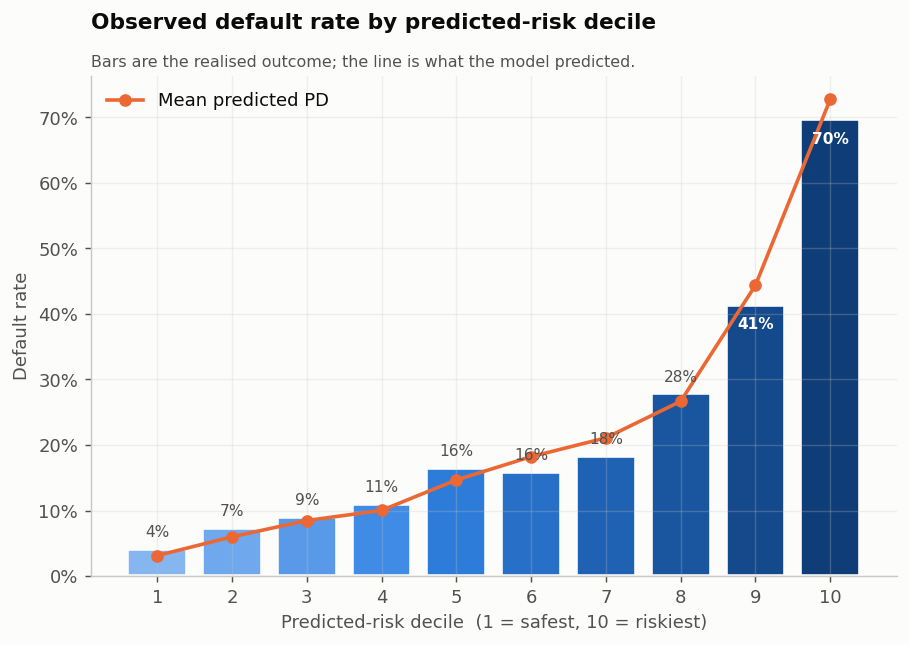
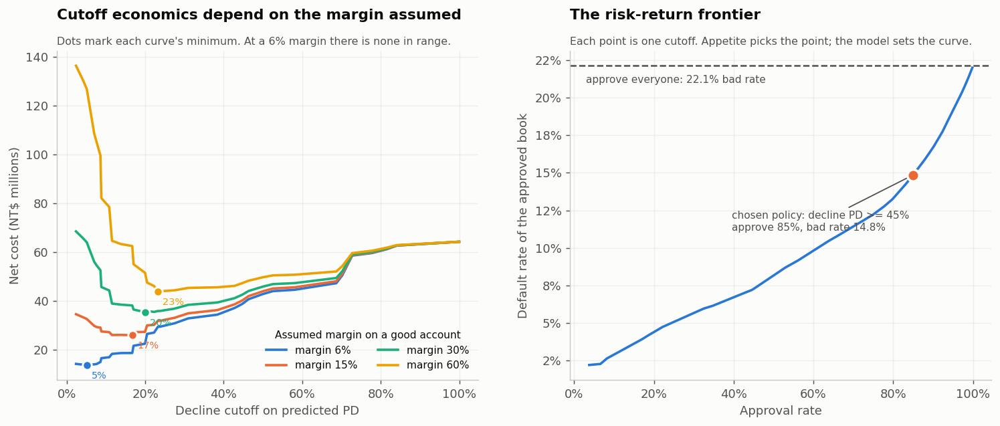
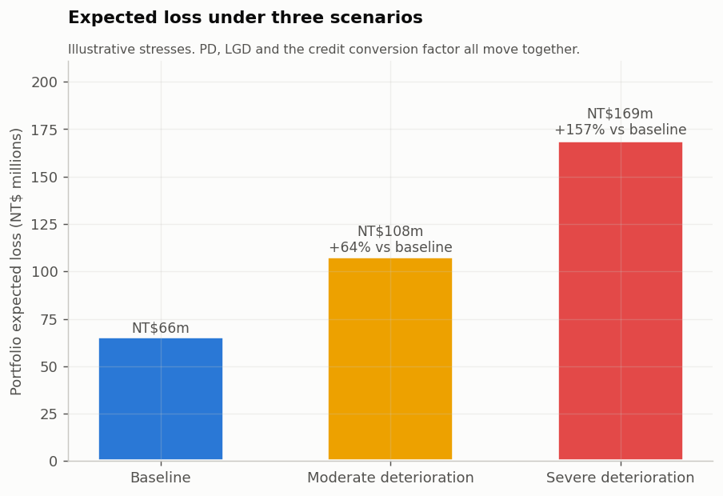
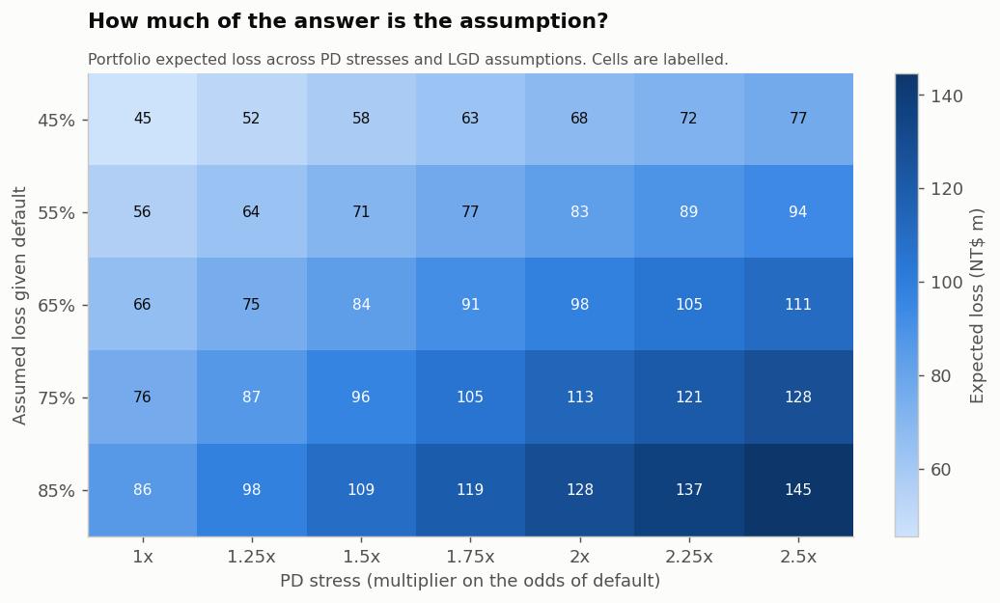
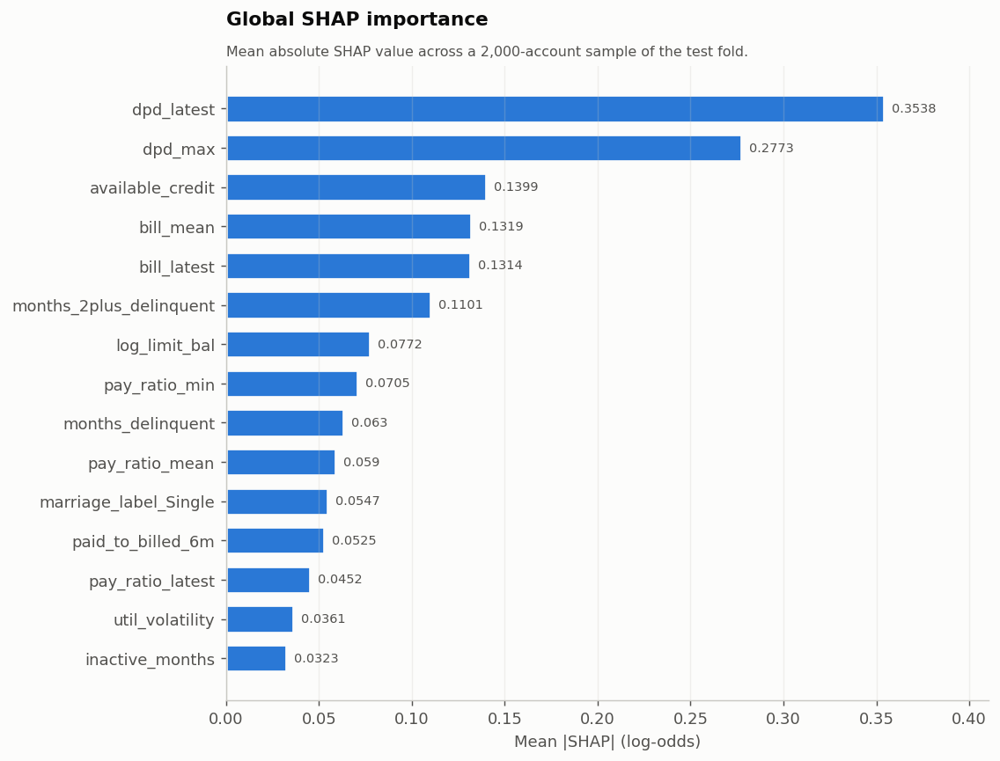
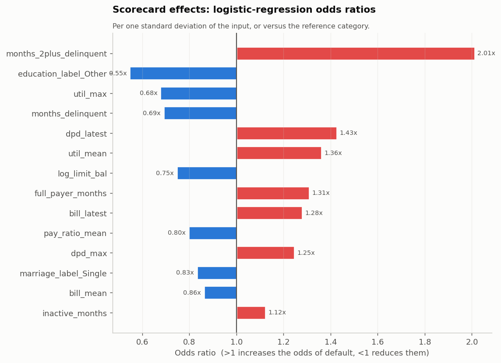

# Consumer Loan Credit Risk Modeling and Expected Loss Analysis

Probability-of-default models and expected credit loss on the UCI *Default of Credit Card
Clients* dataset: 30,000 Taiwanese credit-card accounts from 2005.

## What this is

A lender with customers already on its books wants to know three things: who is about to stop
paying, how much money that puts at risk, and how much worse it gets in a downturn. This
project works through all three.

The first part is a model. Each account gets a probability of defaulting next month, learned
from six months of billing and repayment history: what was owed, what was actually paid, and
how far behind the customer fell.

The second part turns that probability into money. Expected loss is the probability of default
multiplied by the exposure at the moment of default and by the share of that exposure the
lender never recovers. I compute it per account and add it up. Because the model predicts
default *next month*, this is a one-month expected loss, not a 12-month or lifetime figure.

The third part re-runs the loss calculation with worse assumptions: more defaults, lower
recoveries, and borrowers drawing down more of their credit line before they stop paying.

One caveat up front, because it changes how to read every money figure here. Of the three
ingredients in expected loss, only the probability can be measured from this dataset. There is
no recovery or collections data in it, so loss given default is an assumption I set at
65%. Change it and every currency number moves proportionally.

### Ranking versus calibration

Two things a model can be good at, and this project needs both.

Ranking means putting risky accounts above safe ones. That is all you need to decide who to
decline.

Calibration means getting the level right. A predicted 8% should mean 8 defaults per hundred
such accounts. Loss estimates need this, because expected loss multiplies probabilities rather
than comparing them. A model can rank perfectly and still sit 30% low on every account, and
the loss number inherits the error.

Both are measured here, on a test fold the model never saw.

## The question

Can borrower and account characteristics estimate the probability of default, rank accounts by
risk, and translate that into an expected credit loss under baseline and stressed conditions?

Everything below is computed on 5,993 held-out accounts, not used in
training, model selection, calibration or cutoff setting. `python -m src.run_pipeline`
regenerates the numbers and `python -m src.build_reports` regenerates this file from them, so
nothing in this README is typed by hand.

Abbreviations are in the [glossary](#glossary) at the end.

---

## Headline results

| | |
| --- | --- |
| Champion model | **Gradient boosting (XGBoost)** |
| Test ROC-AUC / Gini / KS | **0.778** / 0.556 / 0.427 |
| Test PR-AUC (base rate 22.1%) | **0.552** |
| Brier score / expected calibration error | 0.1351 / 0.0174 |
| Logistic-regression benchmark (ROC-AUC) | 0.764; the champion beats it by 0.0136 |
| Riskiest decile default rate | **70%** vs 4.2% in the safest decile (3.1x lift) |
| Defaults captured in the riskiest two deciles | 50% |
| Portfolio exposure at default (test fold) | NT$549.0m |
| Baseline expected loss, one month | NT$65.7m (11.96% of exposure) |
| Severe-scenario expected loss, one month | NT$168.9m (+157%) |
| Model validation | 10/10 deciles pass binomial test at 99%; calibration slope 0.91 ([report](docs/model_validation_report.md)) |

What those measures mean. ROC-AUC: draw one defaulter and one non-defaulter at random, and ask
how often the model scores the defaulter higher. 0.778 means about
78% of the time; 0.5 would be a coin flip. Gini is the same information
rescaled (0.556). KS is the widest gap between the two score distributions.
PR-AUC matters because only 22.1% of accounts default, and a model with
no skill scores 0.221 there. Brier score and calibration error both ask
whether the predicted percentages are right in level, and both are better when smaller.

Estimated versus assumed: PD is estimated from the data. LGD is not. Nothing in this dataset
records recoveries, so I set it at 65% and say so wherever it appears. EAD is
partly observed: the balance and the credit line are real, the 35% credit
conversion factor on the undrawn portion is mine. `outputs/tables/sensitivity_grid.csv` has the
full PD-stress by LGD surface if you want to see how much of the answer each assumption
carries.

---

## Deliverables

| Deliverable | Where |
| --- | --- |
| Technical notebook | [`notebooks/01_credit_risk_modelling.ipynb`](notebooks/01_credit_risk_modelling.ipynb) |
| Executive summary | [`docs/executive_summary.md`](docs/executive_summary.md) |
| Two-page risk memo | [`docs/risk_memo.md`](docs/risk_memo.md) |
| Model card | [`docs/model_card.md`](docs/model_card.md) |
| Model validation report | [`docs/model_validation_report.md`](docs/model_validation_report.md) |
| Model risk and limitations appendix (one page) | [`docs/model_risk_appendix.md`](docs/model_risk_appendix.md) |
| Data dictionary | [`docs/data_dictionary.md`](docs/data_dictionary.md) |
| Interactive risk dashboard | **[Open the live app](https://credit-risk-el-modeling.streamlit.app)**. Move the LGD, credit-conversion-factor, stress and cutoff sliders and every figure recomputes. Source: [`dashboard/app.py`](dashboard/app.py) |
| Static risk dashboard | **[View it live](https://pooja003-cloud.github.io/credit-risk-el-modeling/dashboard/dashboard.html)**, or open [`dashboard/dashboard.html`](dashboard/dashboard.html) locally |
| Model-comparison table | [`outputs/tables/model_comparison.csv`](outputs/tables/model_comparison.csv) |
| Expected-loss tables | [`outputs/tables/`](outputs/tables/) (`el_by_risk_decile.csv`, `el_by_*.csv`, `scenario_summary.csv`) |
| Figures | [`outputs/figures/`](outputs/figures/) |

---

## Quickstart

```bash
git clone https://github.com/pooja003-cloud/credit-risk-el-modeling.git
cd credit-risk-el-modeling
python -m venv .venv && source .venv/bin/activate    # Windows: .venv\Scripts\activate
pip install -r requirements.txt

python -m src.run_pipeline            # data -> models -> evaluation -> EL -> figures
python -m src.build_static_dashboard  # rebuild dashboard/dashboard.html
python -m src.build_reports           # rebuild README and the written deliverables
streamlit run dashboard/app.py        # interactive dashboard

pytest -q                             # regression tests on the risk maths
python tools/verify_results.py        # recompute every headline number independently
```

The dataset is committed in `data/raw/`, so this runs offline. A full pipeline run takes about
a minute on a laptop.

Only want the dashboard? Skip the pipeline; the tables it reads are committed. `pip install -r
dashboard/requirements.txt` and run it.

---

## Data and preparation

UCI Machine Learning Repository, *Default of Credit Card Clients* (Yeh & Lien, 2009). 30,000
accounts observed April to September 2005, with a flag for whether each one defaulted in
October. Amounts are in New Taiwan dollars.

The loader checks the file against the published statistics before anything else runs:
30,000 rows, 6,636 defaults, a
22.12% default rate, and raises if they do not match.
Mirrors of public datasets get truncated and re-saved, and failing loudly beats training on a
damaged copy.

What I did to the data, all in `src/data_prep.py`:

- Dropped 35 rows that were exact duplicates apart
  from `ID`. Left in, they would put the same account in both training and test.
- Collapsed 468 `EDUCATION` values and
  377 `MARRIAGE` values with undocumented
  codes into "Other". Treating an undocumented code as its own risk level invents signal.
- Kept the 3,932 negative bill amounts. They are credit
  balances from overpayment, not errors. Utilisation features floor them at zero.
- Renamed `PAY_0` to `PAY_1` so repayment status lines up with the bill and payment columns.
- Did not use the raw `PAY_*` codes as a numeric scale. -2 is "no usage", -1 is "paid in full"
  and 0 is "revolving". These are states, not decreasing amounts of lateness. They are split into
  non-negative months past due plus counts of revolving, full-payment and inactive months.
- Built 28 features: utilisation level, trend and volatility;
  payment ratios; delinquency depth, breadth and direction; balance dynamics; available credit;
  demographics.
- Split 60 / 20 / 20, stratified. A time-based split is not possible here. Every account
  shares the same six-month window, so there is no time dimension to split on. That is a real
  limitation and it is in the model card.

### The leakage boundary

The easy half: the target is October 2005 and every feature is dated September or earlier, so
no post-outcome information gets used.

The harder half is being clear about which decision this model supports. With six months of
repayment history it is a behavioural scorecard, used for re-underwriting, limit management
and collections. It is not an application scorecard, because none of that history exists when an
account is opened. Quoting the behavioural AUC as though it applied at origination would be
leakage relative to the decision being made, so I built both:

| Feature set | Model | Features | roc auc | gini | pr auc | ks | brier |
| --- | --- | --- | --- | --- | --- | --- | --- |
| Behavioural (6 months of history) | Logistic regression | 28 | 0.7643 | 0.5286 | 0.5168 | 0.4089 | 0.1381 |
| Behavioural (6 months of history) | Gradient boosting (XGBoost) | 28 | 0.7779 | 0.5557 | 0.5516 | 0.4271 | 0.1351 |
| Origination only (limit + demographics) | Logistic regression | 5 | 0.6217 | 0.2434 | 0.2969 | 0.1841 | 0.1671 |
| Origination only (limit + demographics) | Gradient boosting (XGBoost) | 5 | 0.6267 | 0.2533 | 0.3153 | 0.2003 | 0.1664 |

About 0.15
of ROC-AUC comes from repayment history alone. Strip it out and the model is only modestly
better than chance. That gap is the share of this model's power someone scoring new applicants
would not have.

---

## Models and results

Five model families, each tuned on the validation fold over a small explicit grid, then scored
once on test.

Calibration is a modelling step here, not a finishing touch, because expected loss multiplies
probability *levels* and an uncalibrated ranking score cannot go into `EL = PD x LGD x EAD`.
Isotonic and Platt scaling are compared by five-fold cross-validation inside the validation
fold, because fitting a calibrator and judging it on the same rows lets isotonic win on
flexibility alone. The winner is refit on the whole fold with the base model frozen. The champion ended up on
isotonic.

The calibrated probabilities are then floored at 0.03% and capped at
99.97%. Isotonic calibration is a step function and will hand out exactly 0 or exactly
1 in its outermost steps. A PD of zero drops that account out of the loss calculation
altogether, which is not something that should happen quietly. Basel applies a 0.03% floor to
retail exposures for the same reason.

| Model | Validation ROC-AUC | Test ROC-AUC | PR-AUC | KS | Brier | Calibration error |
| --- | --- | --- | --- | --- | --- | --- |
| Baseline (prior) | 0.5000 | 0.5000 | 0.2213 | 0.0000 | 0.1723 | 0.0000 |
| Logistic regression | 0.7812 | 0.7643 | 0.5168 | 0.4089 | 0.1381 | 0.0117 |
| Decision tree | 0.7808 | 0.7671 | 0.5147 | 0.4080 | 0.1375 | 0.0161 |
| Random forest | 0.7937 | 0.7752 | 0.5349 | 0.4120 | 0.1354 | 0.0171 |
| Gradient boosting (LightGBM) | 0.7918 | 0.7780 | 0.5664 | 0.4296 | 0.1351 | 0.0136 |
| Gradient boosting (XGBoost) | 0.7958 | 0.7779 | 0.5516 | 0.4271 | 0.1351 | 0.0174 |

Accuracy is not a headline here. Approve everyone and you score 78%
accurate on this portfolio while catching no defaults at all.

The boosting gain over the scorecard is real but small: +0.0136 ROC-AUC,
+0.0348 PR-AUC. On this dataset a plain logistic
regression gets most of the way, and a boosted model has to justify its interpretability cost
with more than a third decimal place.

ROC-AUC runs 0.811 on train, 0.796 on validation and
0.778 on test. Mild optimism, nothing alarming. PSI between the training and test
score distributions is 0.0007, far under the 0.10 monitoring
trigger, which it should be for a random split of a single cohort.

### Rank-ordering

| Decile | accounts | defaults | Observed default rate | Mean predicted PD | Lift | Share of exposure | Cumulative defaults captured |
| --- | --- | --- | --- | --- | --- | --- | --- |
| 1 | 600 | 25 | 4.2% | 3.1% | 0.19x | 16.4% | 100% |
| 2 | 599 | 44 | 7.3% | 6.0% | 0.33x | 14.2% | 98% |
| 3 | 599 | 54 | 9.0% | 8.5% | 0.41x | 11.8% | 95% |
| 4 | 599 | 66 | 11.0% | 10.0% | 0.50x | 10.8% | 91% |
| 5 | 600 | 99 | 16.5% | 14.7% | 0.75x | 9.5% | 86% |
| 6 | 599 | 95 | 15.9% | 18.2% | 0.72x | 8.1% | 78% |
| 7 | 599 | 110 | 18.4% | 21.1% | 0.83x | 7.6% | 71% |
| 8 | 599 | 167 | 27.9% | 26.7% | 1.26x | 7.1% | 63% |
| 9 | 599 | 248 | 41.4% | 44.4% | 1.87x | 6.7% | 50% |
| 10 | 600 | 418 | 69.7% | 72.7% | 3.15x | 7.9% | 32% |



### The two errors, and where the cutoff goes

Approve an account that defaults and it costs `LGD x EAD`. Decline one that would have paid and
it costs the margin you would have earned on the balance it would have carried. Under the
assumptions here those differ by roughly a factor of ten, which is why 0.5 is the wrong place
to stand.

| Cutoff rule | PD cutoff | Share declined | Precision | Recall | F1 |
| --- | --- | --- | --- | --- | --- |
| risk_appetite_15%_bad_rate | 44.7% | 15.4% | 0.618 | 0.430 | 0.507 |
| f1_optimal | 27.5% | 25.4% | 0.501 | 0.575 | 0.535 |
| cost_minimising | 5.1% | 92.1% | 0.237 | 0.986 | 0.382 |
| naive_0.5 | 50.0% | 12.4% | 0.663 | 0.373 | 0.477 |

I set the cutoff at 44.7% on the validation fold: the
loosest rule that keeps the approved book's default rate at or under the
15% appetite target. On the test fold it declines
15% of accounts (922), and the realised default rate
of the approved book falls from 22.1% to
**14.9%**. It catches 570 of the
1,326 defaults in the fold and turns away
352 accounts that would have paid.

That is a retrospective evaluation on held-out data. It is not a claim that lending decisions
improved: no decisions were made, and every account the rule declines was in fact given credit,
so there is no counterfactual to observe.

The cost-minimising cutoff comes out at 5.1% and would
decline most of the portfolio. That is not a policy. It is what happens when a one-period loss
is weighed against one period of margin. `outputs/tables/cutoff_margin_sensitivity.csv` shows
the implied cutoff sliding from
5% to
23% as the
assumed margin rises, which is why the deployed cutoff is set by appetite instead.



---

## Expected loss

```
EL = PD x LGD x EAD
```

| Component | How it is obtained | Status |
| --- | --- | --- |
| **PD** | Calibrated champion model | Estimated from data |
| **EAD** | Drawn balance + CCF x undrawn line | Balance and line observed; **CCF 35% assumed** |
| **LGD** | Stated assumption | **Assumed 65%**, not estimable from this dataset |

A card is a revolving commitment, so exposure at the moment of default is not today's balance:
people in trouble draw down further before they stop paying. The balance alone understates it
and the full credit line overstates it. The credit conversion factor is my assumption about how
much of the undrawn line gets used in between.

On the test fold: NT$549.0m of exposure at default, against
NT$307.7m of drawn balances and NT$1,007.5m of committed
limits.

All of this is a one-month horizon: the expected loss over October 2005.

One partial check on that number. Holding LGD fixed, the loss implied by the accounts that
actually defaulted is NT$67.5m, against a modelled
NT$65.7m, a
2.7% gap. I first
described this as testing PD and EAD, but the same EAD and LGD sit on both sides and cancel, so
it only tests PD calibration weighted by exposure. The gap has a specific cause, covered under
[Model validation](#model-validation).

### Scenario analysis

| Scenario | pd odds multiplier | lgd assumed | ccf assumed | average pd | EAD (NT$) | Expected loss (NT$) | EL / EAD | vs baseline |
| --- | --- | --- | --- | --- | --- | --- | --- | --- |
| Baseline | 1.00x | 65% | 35% | 22.55% | 549,007,196 | 65,671,322 | 11.96% | +0% |
| Moderate deterioration | 1.50x | 75% | 45% | 28.33% | 619,550,704 | 107,515,246 | 17.35% | +64% |
| Severe deterioration | 2.25x | 85% | 55% | 34.95% | 690,094,213 | 168,871,865 | 24.47% | +157% |

All three components move together in each scenario, because they do in a downturn. The PD
stress multiplies the *odds* of default rather than the probability, which is a constant shift
on the log-odds scale. Probabilities stay inside (0, 1) and the stress lands proportionately
instead of pushing high-risk accounts past 1.0.

The severities are judgement, not a macroeconomic model, and they are labelled that way
wherever they appear.





---

## Model validation

I reviewed the finished model against two published model-risk frameworks: a validator layout
(five review domains, findings with severity) and an SR 11-7 governance layout. The tests ran on
the held-out test fold. Because I built the model, this is a self-assessment against those
frameworks rather than an independent validation.

| Test | Result |
| --- | --- |
| Discrimination | ROC-AUC 0.778 against a 0.70 threshold |
| Binomial backtest by decile, 99% | 10 of 10 pass |
| Hosmer-Lemeshow | 16.8; p = 0.079 (10 df), 0.032 (8 df). Borderline |
| Calibration slope | 0.91 (1.0 is ideal) |
| Actual-to-expected, by account / by exposure | 0.981 / 1.028 |
| Champion vs challenger, expected loss | 1.9% apart, inside the 5% tolerance |
| Data lineage, 25 records traced to the raw file | 0.0% discrepancy |

The calibration slope is the interesting one. Below 1 means predictions are slightly too spread
out: too low for the safest accounts, too high for the riskiest. Counted by account that nets
out conservative. But the safest accounts carry the biggest balances, so weighted by exposure
the model is optimistic, by about 2.7%. That is
exactly the back-test gap above.

The review turned up 12 findings. Three were documentation errors and are fixed: expected loss had no stated horizon,
the back-test was described as testing more than it does, and the scenario narratives quoted
macroeconomic figures the model never uses. The rest are open and listed with severities in
the [validation report](docs/model_validation_report.md). The opinion, in the
[one-page appendix](docs/model_risk_appendix.md), is approval with conditions for research and
portfolio reporting, and not for credit decisions.

---

## What drives the score

Three views, because one importance ranking is not an explanation:

- Logistic-regression odds ratios: direction and size of each effect, auditable line by line.
- Permutation importance: measured on held-out data, so it reflects what the model leans on
  rather than what it happened to split on.
- SHAP: per-account attributions, which also give reason codes
  (`outputs/tables/reason_codes_*.csv`).

All three land in the same order: recent arrears status first, then how deep and persistent the
delinquency is, then available credit and balance level. How someone has been paying matters
far more than who they are.





---

## Repository layout

```
credit-risk-el-modeling/
├── data/raw/                     UCI dataset, committed so the pipeline runs offline
├── src/
│   ├── config.py                 paths, seeds and every risk assumption in one place
│   ├── data_prep.py              validation, cleaning, features, leakage-aware feature sets
│   ├── models.py                 model ladder, validation-fold selection, calibration
│   ├── evaluate.py               discrimination, calibration, thresholds, deciles, segments
│   ├── expected_loss.py          EAD construction, EL, decision-rule evaluation
│   ├── scenarios.py              PD stressing on the odds scale, scenarios, sensitivity grid
│   ├── explainability.py         odds ratios, permutation importance, SHAP, PSI
│   ├── plots.py                  every figure
│   ├── run_pipeline.py           end-to-end run; writes outputs/tables/results.json
│   ├── build_static_dashboard.py self-contained HTML dashboard
│   └── build_reports.py          regenerates README and the written deliverables
├── notebooks/                    technical walkthrough
├── dashboard/                    Streamlit app + static HTML dashboard
├── docs/                         executive summary, risk memo, model card, data dictionary
├── outputs/{figures,tables,models}
└── tests/                        regression tests on the risk maths
```

---

## Limitations

- One cohort, one outcome month. No out-of-time validation is possible, and the split is
  stratified-random rather than time-based.
- Taiwan, 2005, in the wake of a domestic card-debt crisis. A 22%
  default rate is not a through-the-cycle rate, and none of these levels should be read across
  to another book.
- Behavioural, not application. The champion model needs six months of repayment history.
- LGD is assumed rather than estimated, and every currency figure inherits that.
- No macroeconomic variables. Unemployment and rates enter only through the scenario
  multipliers, not as model inputs.
- Sex, education and marital status are inputs to the model, not just reporting segments.
  Several are prohibited or restricted for credit decisions in many jurisdictions. A deployable
  model would drop them and be tested for disparate impact.
- The source defines default only as "default payment next month", with no days-past-due
  threshold. If some of those accounts cure, a charge-off-scale 65% LGD
  overstates loss, so the expected-loss figures are better read as an upper bound.
- Validation was done by the developer, not independently.

---

## Glossary

In the order the terms first matter, not alphabetical.

| Term | What it means |
| --- | --- |
| **Default** | The customer fails to make the required payment. Here, specifically, failing to pay in October 2005. |
| **PD**, probability of default | The chance that an account defaults, between 0% and 100%. This is what the model predicts. |
| **EAD**, exposure at default | How much the customer owes at the moment they default. Not the same as today's balance: a card is a revolving credit line, and people in trouble tend to draw down more before they stop paying. |
| **CCF**, credit conversion factor | The assumed share of the *unused* part of the credit limit that gets drawn between now and default. Turns today's balance into an exposure at default. Assumed here, at 35%. |
| **LGD**, loss given default | The share of the exposure the lender ultimately fails to recover, after collections and any settlement. Assumed here, at 65%, because this dataset records no recoveries. |
| **EL**, expected loss | `PD x LGD x EAD`. What a lender should expect to lose on an account, in money. |
| **Basis point (bp)** | One hundredth of a percentage point. A 3bp floor means 0.03%. |
| **ROC-AUC** | How reliably the model ranks a defaulter above a non-defaulter. 0.5 is random, 1.0 is perfect. The standard headline measure of discrimination. |
| **Gini** | The same information as ROC-AUC on a 0-to-1 scale, calculated as `2 x ROC-AUC - 1`. Preferred in most credit-risk teams. |
| **KS**, Kolmogorov-Smirnov statistic | The widest separation between the score distributions of defaulters and non-defaulters. The traditional separation measure in retail scorecards. |
| **PR-AUC**, precision-recall area under the curve | Performance on the minority group. More informative than ROC-AUC when defaults are rare. |
| **Precision** | Of the accounts the model flags as risky, the share that really do default. |
| **Recall** | Of all the accounts that really default, the share the model flags. |
| **Calibration** | Whether a predicted 8% really corresponds to 8 defaults in every 100 such accounts. Different from ranking, and essential for loss estimates. |
| **Brier score** | The average squared error of the predicted probabilities. Smaller is better. |
| **Expected calibration error** | The average gap between predicted and observed default rates across risk bands. Smaller is better. |
| **Decile** | A tenth of the portfolio, sorted by predicted risk. Decile 1 is the safest 10%, decile 10 the riskiest. |
| **Lift** | How much more often a group defaults than the portfolio average. A lift of 3 means three times the average rate. |
| **Cutoff** | The predicted-PD level above which an account is declined. |
| **Behavioural scorecard** | A model that uses repayment history on an existing account. Used for limit changes, collections and loss reporting. The champion model here is one. |
| **Application scorecard** | A model that scores a *new* applicant, before any repayment history exists. Built here only as a comparison. |
| **Data leakage** | Using information that would not have been available at the moment of the decision. Flatters results in testing and fails in reality. |
| **Delinquency / arrears** | Being behind on payments, measured here in whole months. |
| **Revolving** | Paying only the minimum and carrying the balance forward. |
| **Utilisation** | The share of the credit limit currently used. |
| **Stress scenario** | A deliberately worse set of assumptions (more defaults, lower recoveries) used to size losses in a downturn. |
| **Log-odds** | The scale credit scores live on. Stressing a model on this scale keeps every probability between 0% and 100% and moves risky and safe accounts proportionately. |
| **Isotonic / Platt scaling** | Two standard methods for correcting a model's predicted probabilities after training. |
| **Calibration slope** | Fitted slope of outcomes on the model's log-odds. 1.0 is ideal; below 1 means predictions are too spread out. |
| **Actual-to-expected (A/E)** | Observed defaults divided by predicted defaults. Above 1 means the model under-predicted. Can be weighted by account or by exposure. |
| **Binomial backtest** | Checks whether each risk band's observed default count is plausible given its predicted PD, here at 99% confidence. |
| **Hosmer-Lemeshow test** | A chi-squared test comparing observed and predicted defaults across risk groups. Very sensitive on large samples. |
| **PSI**, population stability index | How far a scored population has drifted from the one the model was built on. Below 0.10 is stable. |
| **SHAP** | A method that attributes a single prediction to its individual inputs, so a score can be explained account by account. |
| **Champion / challenger** | The model in use, and the simpler or rival model kept alongside it as a benchmark. |
| **Train / validation / test** | The three slices of data: one to fit the model, one to tune and calibrate it, and one left untouched until the end for honest reporting. |

---

## Reference

Yeh, I.-C. and Lien, C.-H. (2009). "The comparisons of data mining techniques for the
predictive accuracy of probability of default of credit card clients." *Expert Systems with
Applications*, 36(2), 2473-2480. Dataset: UCI Machine Learning Repository,
<https://archive.ics.uci.edu/dataset/350/default+of+credit+card+clients>.

Portfolio project. Not investment, credit or financial advice.
